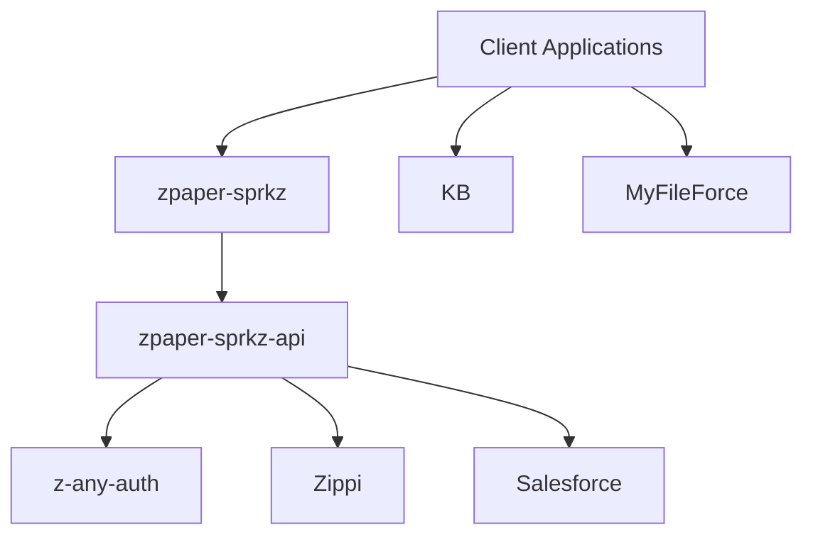

# zPaper GitHub Organization

zPaper is an enterprise document processing and workflow automation platform that integrates deeply with Salesforce and provides advanced PDF handling capabilities.

## Core Components

### Backend Services

#### KB (Knowledge Base)
- Legacy WAR application serving as the foundation for zPaper's document management capabilities
- Built in Java
- Handles core document processing functionality

#### MyFileForce
- Java-based service
- Handles file management and storage operations

#### Zippi & Zippi Testing
- Core Java service for document processing
- Includes dedicated testing repository

### Frontend Components

#### zpaper-sprkz
- Modern UI component library
- Built for zPaper applications running outside of Salesforce
- Provides PDF viewer, thumbnail generation, and toolbar interfaces
- JavaScript-based

#### zpaper-node-red-sprkz
- JavaScript-based Node-RED components
- Enables workflow automation and visual programming capabilities

### API & Integration Layer

#### zpaper-sprkz-api
- NodeJS-based API service
- Handles integration between:
  - AI services
  - Zippi document processing
  - Salesforce
  - Other REST services
- Primary integration point for modern zPaper services

#### z-any-auth
- JavaScript authentication library
- Provides unified authentication handling across zPaper services

#### userinfo-middleware
- JavaScript middleware
- Handles user information and session management

### Shared Resources

#### zpaper-commons
- Core Java library
- Shared utilities and common functionality used across Java services

#### maven-repo
- Custom Maven repository
- Houses third-party artifacts not available in central Maven repository
- Supports dependency management for Java components

## Architecture Overview

## Integration Points

1. **Document Processing Pipeline**
   - Client applications use zpaper-sprkz components for document viewing/manipulation
   - Requests flow through zpaper-sprkz-api
   - Processing handled by Zippi services
   - Storage managed by MyFileForce
   - KB provides legacy support and core functionality

2. **Authentication Flow**
   - z-any-auth provides unified authentication
   - userinfo-middleware manages user sessions
   - Integration with Salesforce authentication when required

3. **Salesforce Integration**
   - Direct API integration through zpaper-sprkz-api
   - Custom workflow automation via zpaper-node-red-sprkz
   - Example implementation available in salesforce-workflow-demo

## Development Guidelines

### Java Components
- Use Maven for dependency management
- Reference zpaper-commons for shared functionality
- Custom dependencies available in maven-repo

### JavaScript Components
- Modern frontend development using zpaper-sprkz
- API integration through zpaper-sprkz-api
- Authentication handled by z-any-auth

## Support

For technical support, please contact support@zpaper.com
